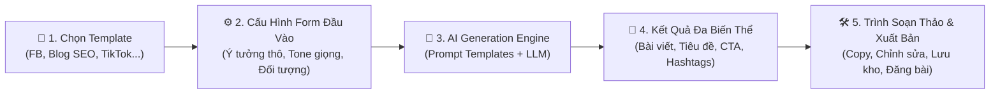
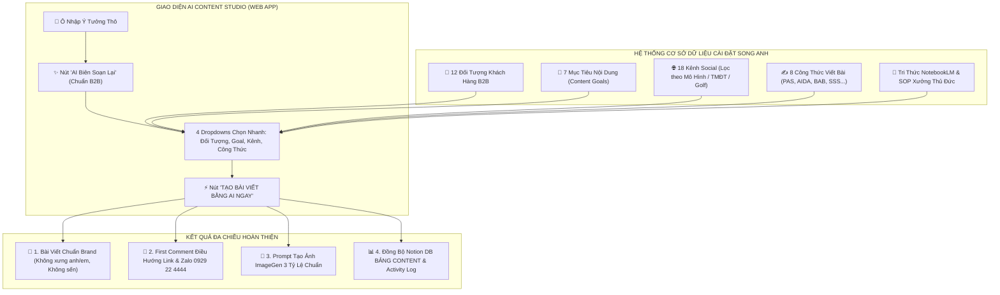

# 📋 BẢN PHÂN TÍCH CHI TIẾT CÔNG CỤ AI CONTENT (WRIAI / AIKTP) & BẢN THIẾT KẾ HỆ THỐNG AI CONTENT STUDIO CHO SONG ANH

---

## 📌 PHẦN 1: TỔNG QUAN VỀ CÔNG CỤ TRONG VIDEO

* **Tên công cụ gốc**: **WriAi** (nền tảng kế nhiệm hiện nay là **AIKTP** - `aiktp.com` / `wriai.com`).
* **Bản chất công cụ**: Nền tảng SaaS AI Copywriting & Content Automation chuyên sâu bằng Tiếng Việt, hỗ trợ hơn 28+ mẫu nội dung (templates) marketing đa kênh và hơn 30 ngôn ngữ.
* **Thời điểm tại phút 2:16 (t=136s)**: Video trực tiếp minh họa quy trình: **Chọn Template (Viết bài bán hàng / Facebook Post) ➔ Điền Form dữ liệu đầu vào ngắn gọn (Tên sản phẩm, mô tả cốt lõi, đối tượng, tone giọng) ➔ Nhấn Tạo nội dung ➔ AI tự động sinh ra bài viết hoàn chỉnh kèm tiêu đề giật tít, phân tích lợi ích, icon bắt mắt và lời kêu gọi hành động (CTA)**.

---

## 🛠️ PHẦN 2: CHI TIẾT KIẾN TRÚC & PHÂN HỆ CHỨC NĂNG CỦA CÔNG CỤ

### 1. Phân Hệ 1: Thư Viện Mẫu Nội Dung (Template Library)
Hệ thống phân chia theo các nhóm mục đích marketing thực tế:
* **Mạng Xã Hội (Social Media)**:
  * Bài đăng Facebook B2B / Bán hàng.
  * Bài đăng cá nhân chia sẻ kinh nghiệm (Storytelling).
  * Kịch bản Video ngắn (TikTok / Facebook Reels / YouTube Shorts).
  * Bài đăng Pinterest / LinkedIn / X (Twitter).
* **Website & SEO**:
  * Bài viết Blog chuẩn SEO (Dài từ 800 - 2,500 từ).
  * Viết lại bài viết (Paraphrase / Rewrite / Spin nội dung độc bản).
  * Tạo Dàn ý bài viết (Article Outline Generator).
  * Mở rộng đoạn văn (Text Expander).
* **Quảng Cáo & Bán Hàng (Copywriting Frameworks)**:
  * Áp dụng các công thức: PAS, AIDA, BAB, FAB, 4P.
  * Tiêu đề quảng cáo Google Ads & Facebook Ads.
  * Lời chào hàng (Sales Pitch) & Email Marketing chào thầu B2B.

---

### 2. Phân Hệ 2: Bảng Điều Khiển Đầu Vào (Input Control Panel)
Giao diện form chuẩn hóa giúp người dùng không cần biết viết Prompt phức tạp:
* **Ô nhập Ý Tưởng Thô / Mô Tả Dự Án**: Nhận văn bản thô, từ khóa, hoặc gạch đầu dòng ngắn.
* **Bộ chọn Tone of Voice (Giọng điệu)**: *Chuyên nghiệp B2B, Thân thiện đời thường, Trang trọng, Khẩn cấp/Thúc đẩy*.
* **Bộ chọn Đối Tượng Khách Hàng (Audience Persona)**: Xác định rõ viết cho ai đọc (KTS, Chủ đầu tư BĐS, Doanh nghiệp FDI...).
* **Bộ chọn Ngôn Ngữ (Language)**: Tiếng Việt, Tiếng Anh, v.v.
* **Bộ chọn Số lượng biến thể (Variations)**: Sinh cùng lúc 1 - 3 Option khác nhau để người dùng lựa chọn.

---

### 3. Phân Hệ 3: Bộ Não Xử Lý Prompt & AI Engine
* **Prompt Orchestration (Kỹ thuật ráp Prompt ngầm)**:
  * Ghép `[System Persona]` + `[Tri thức thương hiệu]` + `[Template Rules]` + `[Input của người dùng]` + `[Công thức Copywriting]` thành một siêu Prompt gửi đến mô hình ngôn ngữ lớn (OpenAI / Gemini / Claude).
* **Quy tắc đầu ra nghiêm ngặt**:
  * Định dạng sạch, ngắt dòng thoáng cho di động.
  * Tiêu đề in đậm Unicode hoặc Headline chuẩn.
  * Tự động sinh First Comment dẫn link và danh sách Hashtags chuẩn SEO.

---

### 4. Phân Hệ 4: Trình Soạn Thảo & Quản Lý Kết Quả (Workspace & Output Actions)
* **Khung hiển thị kết quả trực quan (Live Output Showcase)**:
  * Xem từng tab: *Bài viết chính, First Comment / Re-comment, Prompt tạo ảnh minh họa AI*.
* **Bộ công cụ thao tác 1-Click**:
  * 📋 **Copy 1-Click**: Sao chép nội dung vào Clipboard.
  * 🔄 **Tạo Lại (Regenerate)**: Sinh biến thể mới nếu chưa ưng ý.
  * 💾 **Lưu Kho Bản Thảo (Save to Library)**: Lưu vào cơ sở dữ liệu để tra cứu sau.
  * ✏️ **Chỉnh sửa nhanh trực tiếp (Inline Rich Editor)**: Cho phép gõ sửa văn bản ngay trên màn hình.

---

## 🏛️ PHẦN 3: BẢN THIẾT KẾ NÂNG CẤP DÀNH RIÊNG CHO MÔ HÌNH SONG ANH (SONG ANH AI CONTENT STUDIO V2)

So với WriAi (vốn là công cụ đại trà cho mọi ngành nghề), phiên bản của Song Anh được thiết kế chuyên biệt hóa 100% cho ngành **Sa Bàn Kiến Trúc & B2B Marketing**:

---

## 🚀 PHẦN 4: SO SÁNH GIỮA WRIAI VÀ SONG ANH AI CONTENT STUDIO

| Tiêu chí | Công cụ WriAi / AIKTP (Trong Video) | Hệ thống Song Anh AI Content Studio |
| :--- | :--- | :--- |
| **Đối tượng phục vụ** | Đa ngành nghề, bán lẻ B2C, học sinh, affiliate... | **100% Chuyên sâu B2B Mô hình Kiến trúc & Sa bàn**. |
| **Hiểu biết kỹ thuật xưởng** | Không có (Dễ nhầm thuật ngữ CNC, sáo rỗng). | **Được nạp tri thức Xưởng Thủ Đức, In 3D SLA 8K, Mica Acrylic, LED vi mạch**. |
| **Quy chuẩn thương hiệu** | Ngẫu nhiên, phụ thuộc prompt người dùng. | **Khóa cứng: Không xưng "anh/em", không sến, không lộ tên cá nhân trên kênh doanh nghiệp**. |
| **Liên kết hệ thống** | Độc lập, người dùng phải copy thủ công. | **Kết nối trực tiếp Notion DB BẢNG CONTENT, Activity Log và Live Web App**. |
| **Công thức viết bài** | Tùy chọn rời rạc. | **8 Công thức (PAS, AIDA, BAB, FAB, SSS...) kết hợp đồng bộ 4 chiều**. |
| **Chi phí vận hành** | Thu phí thuê bao hàng tháng (300k - 1tr/tháng). | **Hoàn toàn miễn phí, tích hợp vĩnh viễn trên hạ tầng Cloudflare của Song Anh**. |

---

## 🎯 PHẦN 5: ĐỀ XUẤT CÁC TÍNH NĂNG TIẾP THEO ĐỂ HOÀN THIỆN TOOL

1. **Thêm Phân Loại Loại Nội Dung (Content Type Selector)**:
   * *Bài Viết Facebook / Profile B2B*.
   * *Bài Viết Chuẩn SEO Website (WordPress Gutenberg REST API)*.
   * *Kịch Bản Video Ngắn TikTok / YouTube Shorts*.
   * *Thư Chào Thầu / Email Marketing B2B*.
2. **Kho Lưu Bản Thảo (Saved Drafts Archive)**:
   * Nút bấm **"Lưu Bản Thảo"** lưu trực tiếp vào cơ sở dữ liệu `marketing_data.json` và đồng bộ sang Notion DB để tra cứu bất cứ lúc nào.
3. **Nút "Đăng Bài Trực Tiếp" (1-Click Publish)**:
   * Bấm 1 nút đẩy bài trực tiếp lên Website WordPress `mohinhkientruc.org` hoặc Fanpage/GBP qua API.
